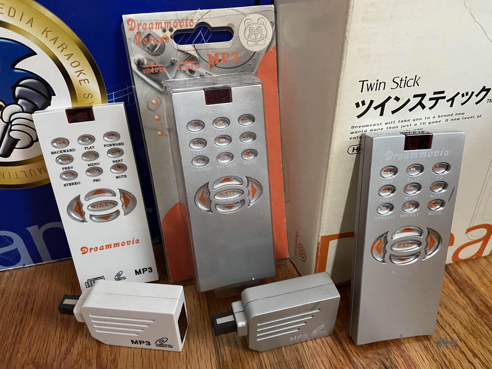

# DreamMovie "UNLOCKED"



**A patch to finally unlock the best VCD player the SEGA Dreamcast ever saw!**

DreamMovie "UNLOCKED" removes the proprietary IR dongle requirement from the DreamMovie VCD/MP3 player, replacing it with full standard Dreamcast controller support. For the first time, anyone with a Dreamcast can use this software without needing the original (and now extremely rare) hardware.

---

## Table of Contents

- [Current Version](#current-version)
- [Changelog](#changelog)
- [Credits](#credits)
- [How to Use](#how-to-use)
  - [Burning to Disc](#burning-to-disc)
  - [Using an Optical Drive Emulator (GDEMU)](#using-an-optical-drive-emulator-gdemu)
  - [Using an Optical Drive Emulator (MODE)](#using-an-optical-drive-emulator-mode)
- [MP3 Support Confusion](#mp3-support-confusion)
- [A Personal Note](#a-personal-note)
- [What is DreamMovie?](#what-is-dreammovie)
  - [The Hardware](#the-hardware)
  - [The Earlier Version](#the-earlier-version)
  - [The Good Version](#the-good-version)
- [Locked Behind a Dongle](#locked-behind-a-dongle)
  - [How the Protection Worked](#how-the-protection-worked)
  - [The Challenge-Response Protocol](#the-challenge-response-protocol)
- [Breaking In](#breaking-in)
  - [First Clues](#first-clues)
  - [A Disc Full of Red Herrings](#a-disc-full-of-red-herrings)
  - [Finding the Real Binary](#finding-the-real-binary)
- [Teaching an Old Player New Tricks](#teaching-an-old-player-new-tricks)
  - [The Controller Mapping](#the-controller-mapping)
  - [Writing a Maple Bus Protocol Swap in 138 Bytes](#writing-a-maple-bus-protocol-swap-in-138-bytes)
- [Going Deeper: Code Caves and SH4 Assembly](#going-deeper-code-caves-and-sh4-assembly)
  - [Where to Put New Code in a Binary You Cannot Recompile](#where-to-put-new-code-in-a-binary-you-cannot-recompile)
  - [The VMU Icon Problem](#the-vmu-icon-problem)
  - [The Auto-Advance Saga](#the-auto-advance-saga)
- [Cleanup and Enhancements](#cleanup-and-enhancements)
  - [Fixing the "Engrish"](#fixing-the-engrish)
  - [Better Default Picture Settings](#better-default-picture-settings)
  - [Title Screen Branding](#title-screen-branding)
- [Building the Disc: The CDI Patching Pipeline](#building-the-disc-the-cdi-patching-pipeline)
- [What DreamMovie Still Cannot Do](#what-dreammovie-still-cannot-do)

---

## Current Version

DreamMovie "UNLOCKED" is currently at version [1.0](https://github.com/DerekPascarella/DreamMovie-UNLOCKED/releases/download/1.0/DreamMovie.UNLOCKED.v1.0.cdi).

## Changelog

- **Version 1.0 (2026-04-XX)**
  - Initial public release.
  - Dongle check fully bypassed.
  - Standard Dreamcast controller support with complete button mapping.
  - VMU LCD icon display on boot.
  - OSD text and texture cleanup.
  - Improved default picture settings.

## Credits

- **Derek Pascarella (ateam)**
  - Reverse engineering, SH4 assembly patching, controller input implementation, OSD/texture edits, build tooling, testing.
- **Chris Daioglou (dreammods)**
  - Custom Maple bus decoder that provided critical early clues about the dongle's communication protocol.

---

## How to Use

Users must connect their controller in Port A for DreamMovie to recognize it (see more in the [Writing a Maple Bus Protocol Swap in 138 Bytes](#writing-a-maple-bus-protocol-swap-in-138-bytes) section).

### Burning to Disc

1. Download the [latest release CDI](https://github.com/DerekPascarella/DreamMovie-UNLOCKED/releases).
2. Burn to CD-R with software like DiscJuggler, ImgBurn, or similar.
3. Boot Dreamcast console with DreamMovie UNLOCKED disc in GD-ROM drive.
4. Swap in VCD disc at the title screen.

### Using an Optical Drive Emulator (GDEMU)

GDEMU users are encouraged to use my [openMenu Virtual Folder Bundle](https://github.com/DerekPascarella/openMenu-Virtual-Folder-Bundle) package. Accordingly, the instructions below are written with that package in mind.

1. Download the [latest release CDI](https://github.com/DerekPascarella/DreamMovie-UNLOCKED/releases).
2. Add the CDI to your GDEMU SD card using GD MENU Card Manager.
3. Add one or more VCD disc images to your SD card sequentially after DreamMovie (e.g., if DreamMovie is in slot `23`, place your first VCD disc in slot `24`). Note that as of version 1.5.2, GD MENU Card Manager will automatically convert any CUE-based disc images to a GDEMU-compatible format.
4. Ensure that the Title and Serial values for DreamMovie plus subsequent VCD discs are identical.
5. Ensure that DreamMovie's disc number/count is `1/X`, where `X` represents the total number of discs. A typical two-disc VCD (e.g., "Metropolis"), for example, would start with DreamMovie as disc `1/3` using the Title value "Metropolis" and a custom Serial value like `VCDMETR`. The first VCD disc for the film would be marked as disc `2/3` and share the same Title and Serial values ("Metropolis" and `VCDMETR`, respectively), and so on.
6. Save your SD card.
7. After launching the first disc (i.e., DreamMovie), press GDEMU's disc-swap button at the DreamMovie title screen to cycle to the first disc in the VCD set.

Note that you can create as many of these DreamMovie plus VCD disc sets as desired on your SD card. Simply repeat steps 3-5 for each.

### Using an Optical Drive Emulator (MODE)

1. Download the [latest release CDI](https://github.com/DerekPascarella/DreamMovie-UNLOCKED/releases).
2. Create a folder on your MODE's storage device with the name of your choosing (e.g., "DreamMovie (UNLOCKED v1.0)") and copy the CDI into it.
3. Copy any number of VCD discs to your MODE's storage device in the folder(s) of your choosing.
4. Once booted to the MODE menu, place cursor over the DreamMovie entry and hold the A button.
5. In the menu that appears, select "Add Disc to Queue."
6. Place cursor over one or more VCD discs and add those to the queue as well.
7. Once complete, hold the A button to bring up the same menu, then select "Launch Current Queue."
8. After launching, press the MODE's disc-swap button at the DreamMovie title screen to cycle to the first disc in the VCD queue.

---

## MP3 Support Confusion

Why am I confused? It's simply, really...

As a kid, I am almost entirely confident I used DreamMovie to play MP3s burned to CD-Rs. The packaging itself touts MP3 support!

However, no matter what I try, I can't get any basic CD-R containg one or more MP3s to be recognized, nor can I use any ODE with an ISO of said disc to be recognized either.

Funny enough, one variant of the DreamMovie packaging (from BearCity) claims SVCD support, which is an outright lie. Does this mean MP3 support is a lie too and I hallucinated the entire childhood tune-rockin' memory?

Maybe, but I don't think so...

That being said, if you can't get your MP3 discs to work, don't feel too badly. More importantly though, if *you can* get one to work, please [reach out to me](https://dreamcastforever.com/?page=contact_information)!

---

## A Personal Note

I was twelve years old when I bought my DreamMovie unit. At the time, the Dreamcast was already fading from store shelves, but for a kid obsessed with imported media, the idea of turning a game console into a VCD player was irresistible. That purchase kicked off what became a lifelong obsession with collecting commercial VCD releases from all over the world.

Fast forward to 2026, and the DreamMovie hardware has become incredibly rare. The IR receiver dongles break, get lost, or simply never show up in the occasional eBay listing. The best VCD playback software the Dreamcast ever saw was locked behind a piece of proprietary plastic that fewer and fewer people still own.

This project started as a "wouldn't it be cool if" thought experiment and turned into untold hours of reverse engineering, SH4 assembly hacking, and more test builds than I care to count. The goal was simple: make DreamMovie work with a standard Dreamcast controller, so that anyone can use it.

---

## What is DreamMovie?

### The Hardware

DreamMovie is an unlicensed SEGA Dreamcast peripheral that turns the console into a VCD (Video CD) and MP3 player. It was released around 2001, sold through outlets like the now-defunct Lik-Sang online store, and for a while was all over eBay. The product was manufactured and distributed under various Chinese company brands, including BearCity and SRC, both of which were known for producing unlicensed console accessories and add-ons during that era.

The package included:
- A proprietary IR receiver that plugs into any controller port
- A small IR remote control (powered by two CR2032 coin cell batteries)
- A self-booting CD-R containing the DreamMovie software

The IR receiver doubles as both an input device (receiving remote control commands) and a hardware dongle (authenticating with the software via challenge-response). Without the receiver plugged in, the software locks up on the title screen.

### The Earlier Version

DreamMovie was not the first attempt at a Dreamcast VCD player. An earlier iteration, commonly referred to as "Dream VCD Player" (its title screen credited "XingHong Electronic Co., Ltd."), existed before it. That version had no IR remote control at all and suffered from serious audio/video synchronization and rendering issues. It did, however, require a controller port dongle to be present in order to operate, the need for which was cracked by the old-school Dreamcast scene release group **Echelon** back in the day, making it freely available. That said, its poor playback quality meant most saw it as nothing but a passing curiosity.

### The Good Version

DreamMovie was the follow-up that got it right. The video playback is clean, the audio stays perfectly in sync, and it handles VCD discs reliably. It is, to this day, the best VCD playback software ever made for the Dreamcast. There is simply nothing else on the platform that comes close.

But it shipped with that dongle and remote requirement, and with these units being unobtanium (or cost prohibitive when found on auction sites), the software became effectively inaccessible to anyone who did not already own one.

Until now...

---

## Locked Behind a Dongle

### How the Protection Worked

The DreamMovie dongle is not just an IR receiver. It is an active authentication device that participates in a continuous challenge-response protocol over the Dreamcast's Maple Bus (the standard peripheral communication bus that controllers, VMUs, and other accessories use).

Here is what happens every frame during normal operation:

1. The software picks a random mode (0 through 3) using a timer-based RNG
2. It constructs a challenge word by combining the mode selector, two secondary keys derived from the random seed, and a 16-bit key value, all packed into a 32-bit word with a `0x40000000` flag
3. It bit-interleaves the challenge through `FUN_8c01f080`, shuffling the data bits into even/odd positions to make the on-wire traffic harder to predict or replay
4. It pre-computes the expected response using one of four XOR formulas (selected by the mode)
5. It sends the challenge to the dongle via Maple DMA
6. The dongle sends back its XOR-encoded answer
7. The software decodes and compares

If the dongle fails to respond correctly more than five times, or if two seconds pass without a valid device on the bus, the software locks out. The error counter resets every 60 seconds (3600 frames), so even intermittent communication glitches are tolerated, but the dongle truly needs to be present and functioning.

### The Challenge-Response Protocol

The challenge word is assembled like this:

```
challenge = (mode << 27) | (tertiary_key << 24) | (secondary_key << 16) | key_seed | 0x40000000
```

Four XOR decode modes handle the response. Each mode picks different bytes from the two response words and XORs them with different halves of the key. For example, Mode 0:

```
decoded = (resp1_byte3 XOR key_high) | (resp1_byte2 XOR key_high) |
          (resp0_byte1 XOR key_low)  | (resp0_byte2 XOR key_low)
```

The other three modes shuffle which bytes get XOR'd and which pass through raw, making it impractical to fake responses without knowing the algorithm.

This is a well-designed protection for a 2001-era consumer product. It is not trivially replayable, it is not a static key check, and the randomized mode selection with bit interleaving makes bus sniffing alone insufficient to clone the dongle.

In short, it's borderline insane that a $25 unlicensed media player for the Dreamcast went to such lengths to thwart "unauthorized" use of its software, but I must say that Chris and I are both impressed!

---

## Breaking In

### First Clues

The first real breakthrough came from Chris Daiglou, who built a custom Maple bus decoder capable of capturing and analyzing the raw traffic between the Dreamcast and the dongle. His work made it possible to observe the challenge-response exchanges in flight and understand the communication pattern: the software was sending structured commands and expecting structured replies, not just polling for a device presence flag.

Armed with that knowledge, I turned to the disassembly.

### A Disc Full of Red Herrings

Before even reaching the binary, the disc itself throws up some obstacles. The DreamMovie disc's file listing looks like this:

```
┌── 0GDTEX.PVR
├── 1ST_READ.BIN
├── BACK.PVR
├── CUBE
├── DCVCD.EXE
├── DISK.PVR
├── FLAG.PVR
├── IP.BIN
├── LOGO.PVR
├── MANATEE2.DRV
├── MANATEE.DRV
├── MP210R.MLT
├── MSL.OUT
├── SEGA.PCX
└── WINCE
    ├── ARIAL.TTF
    ├── ARMCOM.DRV
    ├── D3DIM.DLL
    ├── DDHAL.DLL
    ├── DDI.DLL
    ├── DDRAW.DLL
    ├── DINPUTX.DLL
    ├── DSOUND.DLL
    ├── MAPLEDEV.DLL
    ├── MAPLE.DLL
    ├── MMTIMER.DLL
    ├── OLEAUT32.DLL
    ├── PLATUTIL.DLL
    ├── SNDCORE.DLL
    ├── TIMER.DLL
    ├── TOOLHELP.DLL
    ├── WDMLIB.DLL
    ├── WDMOEM.DLL
    └── WSEGACD.DLL
```

See that `WINCE` directory full of DirectDraw, DirectSound, and Maple DLLs? See the `DCVCD.EXE` (a genuine Windows CE PE32 binary, by the way)? It all screams "this is a Windows CE application." A prospective reverse engineer would reasonably look at `DCVCD.EXE` first, load it into a disassembler expecting ARM or SH4 WinCE code, and end up chasing a dead end.

None of it is functional. The Windows CE files are decoys.

In fact, I'm fairly confident that even `1ST_READ.BIN` itself is a decoy too (see the [Building the Disc: The CDI Patching Pipeline](#building-the-disc-the-cdi-patching-pipeline) section).

### Finding the Real Binary

The actual software lives in `MSL.OUT`, a 472,076-byte binary loaded into Dreamcast RAM at address `0x8c006800`. It's a standard Katana SDK (not Windows CE) application, built with the SEGA development libraries and CRI Middleware. The file starts with an `SDRV` container header that embeds a copy of the ARM7 AICA sound driver (`manatee.drv`), followed by the SH4 executable code starting at file offset `0x9800` (which takes us to the typical base address of `0x8c010000`).

To find it, I used one of my common tricks: boot the game in an emulator that has a debugger, pause at some arbitrary moment during "this is the area I want to see" execution, then look at what instruction the debugger stopped on. From there, it's just a matter of finding what file contains the byte array representing that visible series of instructions.

With the real executable identified, Ghidra handles SH4 disassembly pretty well, especially after you figure out that `0x8c006800` is the base address for `MSL.OUT` (something I was able to calculate thanks to a debugger and its reported memory addresses for instructions). After that, it was a matter of finding the dongle check code, understanding how IR remote input reached the rest of the application, and figuring out how to replace the whole pipeline.

---

## Teaching an Old Player New Tricks

The core challenge was this: the DreamMovie binary has zero code for reading a standard Dreamcast controller. It was never designed for one. The only input path in the entire application flows through the IR dongle's Maple responses, decoded through the challenge-response XOR logic described above. Every button press, every menu navigation, every play/pause/mute/etc. command enters the system as a decoded bitmask from that dongle protocol.

The solution was to replace the dongle communication with standard controller polling, and translate the controller's button format into the IR remote bitmask format that the rest of the application already understands. The application's button handler (`FUN_8c01553c`) dispatches on IR bitmask values through a large binary search tree. If we can produce the right bitmask values from a controller, the entire rest of the application works without (much) modification.

### The Controller Mapping

The IR remote has 13 functional buttons (excluding PBC, which is dead code in the firmware anyway). A standard Dreamcast controller has roughly 15 usable inputs: A, B, X, Y, Start, D-Pad (four directions), Analog stick (four directions), and L/R analog triggers. Plenty of room to map!

| Controller | Remote Function |
|---|---|
| **D-Pad Up** | Volume up, menu navigation |
| **D-Pad Down** | Volume down, menu navigation |
| **D-Pad Left** | Shift audio balance to the left, menu navigation, confirm |
| **D-Pad Right** | Shift audio balance to the right, menu navigation, confirm | 
| **A** | Pause / Play |
| **B** | Mute |
| **X** | Sound channel toggle |
| **Y** | Playback options menu |
| **Start** | Track selection menu |
| **L Trigger** | Previous track |
| **R Trigger** | Next track |
| **Analog Left** | Rewind (press or hold) |
| **Analog Right** | Fast-forward (press or hold) |

### Writing a Maple Bus Protocol Swap in 138 Bytes

The replacement lives at address `0x8c01ee2a` (file offset `0x1862A`), occupying exactly 138 bytes of what used to be the dongle response decoder. Instead of XOR-decoding a cryptographic response, it reads raw controller data from the Maple DMA response buffer.

Here is the core of the translation logic, in SH4 assembly:

```asm
; Read controller response and invert (active-low to active-high)
mov.l  @(0x08,r4),r0      ; r0 = response buffer pointer
mov.l  @(0x8,r0),r3       ; r3 = response word 2 (buttons + triggers)
not    r3,r3              ; invert: active-low -> active-high
shlr16 r3                 ; shift button bits to lower 16
mov    #0,r1              ; r1 = IR bitmask accumulator (starts at 0)

; Example: D-Up (bit 4) -> IR bitmask 0x0800
mov    r3,r0
tst    #0x10,r0           ; test D-Up bit
bt     skip_dup           ; skip if not pressed
mov.w  @(disp,PC),r2      ; r2 = 0x0800 (IR Up/Prev Track bitmask)
or     r2,r1              ; accumulate into IR bitmask

skip_dup:
; ... repeat for each of the button mappings ...
```

Each button follows the same pattern: test a bit, branch if not pressed, load the corresponding IR bitmask constant from a literal pool, OR it into the accumulator. After all buttons are processed, the accumulated bitmask is stored where the rest of the application expects to find it. The entire input path, from Maple DMA to the button handler's binary search tree, works exactly as if an IR remote had been used.

To make this work, two other patches are also needed.

The dongle handshake function (`FUN_8c01ed58`) normally scans all four controller ports looking for a device that responds with `0x20888888` (the dongle's device ID). A standard controller will never respond with this, so the handshake is stubbed to **hardcode Port A (users must connect their controller to the first port)**.

The challenge generator (`FUN_8c01ef20`) is replaced entirely. Instead of building a cryptographic challenge with random keys and bit interleaving, it sends a standard Maple "Get Condition" command:

```
Frame word 0: 0x09200001  (Get Condition, Port A, 1 data word)
Frame word 1: 0x00000001  (Function type = Controller)
```

This is the exact same command the Dreamcast BIOS sends when polling a controller. The response comes back with button states in word 2, which our translation code then converts.

---

## Going Deeper: Code Caves and SH4 Assembly

### Where to Put New Code in a Binary You Cannot Recompile

A recurring problem when patching a compiled binary is: where do you put new code? You typically cannot make the file bigger, and you cannot relink the binary. Every byte of new functionality has to fit inside the existing binary's footprint.

The answer: **code caves**. When we replaced the dongle check with controller polling, we killed the challenge generator, the response decoder, the handshake scanner, and the dongle watchdog timer. All that dead code became available real estate.

Below is a map of all such code caves.

| Cave | RAM Address | File Offset | Size | Contents |
|---|---|---|---|---|
| Cave 1 | `0x8c01ec8c` | `0x1848C` | 128 bytes | VMU icon wrapper (52B) + auto-advance wrapper (56B) |
| Cave 2 | `0x8c01ed30` | `0x18530` | 24 bytes | Flag byte storage + padding |
| Cave 3 | `0x8c01ed60` | `0x18560` | 28 bytes | Trampoline code |
| Cave 4 | `0x8c01efc0` | `0x187C0` | 252 bytes | VMU DMA command block + icon bitmap |

The old challenge generator body alone freed up 275 bytes of contiguous space. Combined with the stubbed handshake and watchdog functions, there was enough room for an entirely new feature: VMU icon support!

### The VMU Icon Problem

With a standard controller connected, there is now typically a VMU sitting in its socket, staring blankly at the user. All Dreamcast software worth its salt displays a custom icon on the VMU's 48x32 monochrome LCD (except "Death Crimson 2", but I fixed that problem with my English translation patch too). DreamMovie, having been designed for an IR remote with no VMU, does nothing.

The obvious solution would be to call `_pdVmsLcdWrite`, the standard SEGA PD (Peripheral Driver) library function for writing to VMU screens. The function exists in the binary (DreamMovie links the full PD library, v1.46). There is just one problem: the PD library was never initialized. Without initialization, the PD library's internal state structures are all zeroed out, its DMA ring is dormant, and calling any of its peripheral functions would crash.

Initializing the PD library properly would require calling `_pdGunSetCallback`, which calls `_kdInitSystem`, which sets up the entire Maple bus driver stack, DMA buffers, interrupt handlers, and port management. Bringing all of that to life inside a running binary, without breaking the custom Maple DMA polling we just set up for controller input, was not feasible.

So I went lower. Much lower.

The solution was to build a raw Maple DMA Block Write command by hand, embed it directly in the binary, and trigger it with a one-shot wrapper. The complete 212-byte DMA command block sits in Cave 4 and includes:

| Offset | Contents |
|---|---|
| `+0x00` | Receive buffer pointer (physical address) |
| `+0x04` | `0x00000000` (padding) |
| `+0x08` | `0x3200010C` (frame header: 50 data words, Port A to VMU slot 1, cmd = Block Write) |
| `+0x0C` | `0x00000004` (function type: LCD) |
| `+0x10` | `0x00000000` (partition 0, block 0) |
| `+0x14` | 192 bytes of icon bitmap data (48x32, 1 bit per pixel) |

The wrapper function in Cave 1 checks a one-shot flag byte (in Cave 2), and on the very first frame of execution, writes the DMA start address to the Maple DMA control register (`0xA05F6C04`), sets the trigger bit (`0xA05F6C18`), and clears the flag so it never fires again. One raw DMA transaction, no SDK functions, no library initialization. The icon appears on the VMU and stays there.

Getting the command byte right was its own adventure. The initial implementation used command `0x0B` (Block Read). Seven failed test iterations later, I spoke with Chris who set me straight on some Maple protocol details that I was horribly misunderstanding: block Write is command `0x0C`, not `0x0B`! A one-digit mistake cost me hours of debugging.

### The Auto-Advance Saga

VCD discs can contain multiple video files (tracks). A proper VCD player, when it reaches the end of one track, should automatically start playing the next one. DreamMovie has this feature built in. When the dongle check was replaced with controller input, auto-advance inexplicably broke.

It took a long time to figure out why.

DreamMovie uses bit `0x800` in its player state word as a monitoring gate. Here is how the lifecycle is supposed to work:

```
BOOT:       Init sets bit 0x800 (gate CLOSED, monitoring blocked)
                |
USER PRESSES PLAY (via dongle):
            Dongle response processing clears bit 0x800 (gate OPEN)
                |
TRACK ENDS: Monitoring path checks FUN_8c017298 (more tracks?)
            If yes: FUN_8c01f0bc starts next track
            If no:  Re-sets bit 0x800 (gate CLOSED again)
                |
DISC SWAP:  Init runs again, bit 0x800 set (safe state)
```

The problem: when we replaced the dongle protocol with controller polling, we also killed the code path that cleared bit `0x800`. The dongle response decoder had a side effect: as part of its normal operation, it would clear that bit when valid input was received. Our replacement controller code faithfully translated button presses into IR bitmasks, but it never touched the state word's monitoring gate. Bit `0x800` stayed set forever. The auto-advance monitoring path checked it every frame, saw the gate was closed, and did nothing.

The fix is a 56-byte wrapper function at `0x8c01ecc0` (Cave 1), inserted into the per-frame execution path via a trampoline hook:

```asm
; Auto-advance wrapper (0x8c01ecc0)
; Called every frame via trampoline at 0x8c01ed60

sts.l  pr,@-r15              ; save return address
bsr    FUN_8c01ec8c          ; call VMU wrapper first (piggyback)
nop

mov.l  @(controller_data),r0
mov.l  @r0,r0                ; r0 = raw controller data at 0x8C098200
tst    r0,r0                 ; is it zero? (DMA hasn't run yet on frame 1)
bt     .done                 ; if zero, skip (prevents false trigger on boot)

tst    #0x04,r0              ; test A button (bit 2, active-low: 0 = pressed)
bf     .done                 ; not pressed, skip

mov.l  @(player_struct),r0
mov.l  @r0,r0                ; r0 = player struct pointer
mov.l  @(0x08,r0),r1         ; r1 = state word
mov.w  @(mask_0800),r2       ; r2 = 0xF7FF (inverse of 0x0800)
and    r2,r1                 ; clear bit 0x800 (open the gate)
mov.l  r1,@(0x08,r0)         ; write back

.done:
lds.l  @r15+,pr              ; restore return address
rts
nop
```

The zero-data guard (`tst r0,r0` / `bt .done`) is critical. On the very first frame after boot, the controller DMA has not yet executed, so the data buffer contains `0x00000000`. Since the buttons are active-low, all-zeros means "every button pressed," which would falsely detect an A press and open the gate immediately, causing the player to auto-advance on boot before the user has even selected a file. An earlier version without this guard did exactly that.

With the wrapper in place, the lifecycle works again: boot with gate closed, user presses A to start playback, gate opens, auto-advance proceeds normally through multi-file VCDs, and disc swaps reset cleanly.

---

## Cleanup and Enhancements

### Fixing the "Engrish"

DreamMovie was developed in China, and the English text in the UI, while functional, had some rough spots.

**OSD string changes in MSL.OUT:**

| Original | Patched |
|---|---|
| VCD Slowly Play | Slow playback |
| VCD Fast Play | Fast playback |
| VCD picture brightoft | Picture black level |

Several other OSD labels (like "VCD picture size", "VCD picture position") were also cleaned up for consistency, dropping the redundant "VCD" prefix.

In addition, several OSD indicator textures embedded in `FLAG.PVR` (a 512x512px twiddled ARGB4444 PVR texture) were edited to fix awkward wording and improve readability.

There was also one texture that was removed entirely: the PBC indicator icon.

PBC (Playback Control) is a VCD feature for interactive menus. DreamMovie has a PBC toggle button on its remote (the status of which is reflected by a PBC icon on the OSD), but the underlying functionality is completely dead code. The PBC bit gets toggled in memory and the icon renders, but nothing in the playback engine ever reads that bit. Since we had already run out of controller buttons to map, removing the icon was the path of least resistance rather than writing an assembly hack to toggle PBC off by default.

### Better Default Picture Settings

DreamMovie ships with a "brightoft" (brightness offset) filter enabled by default at level 1 out of 14. This filter (which I renamed to "Picture black level") washes out black levels noticeably. The "UNLOCKED" patch changes the default from 1 to 0, disabling the filter. The result is deeper blacks and a more natural-looking picture out of the box.

Users can still adjust all of these through the OSD menus. The new defaults simply provide a better starting point.

---

## Building the Disc: The CDI Patching Pipeline

All of my attempts to rebuild the CDI disc image from scratch (extracting files, modifying them, remastering a new image) produced discs that would not boot. Whether this was due to additional protection mechanisms in the disc structure, subtle sector layout requirements, or something else entirely, the rebuilt images were simply not functional.

I will say though that my high-level analysis of DreamMovie's `IP.BIN` reveals `1ST_READ.BIN` is likely also a decoy, and it has custom code to launch `MSL.OUT` in some way that I can't reproduce with my own standard `IP.BIN`.

All of that said, good hacking to me *usually* means taking the path of least resistance. As such, the solution was to skip rebuilding the disc image entirely, and instead patch the original CDI image in-place. Four Python scripts handle the complete pipeline (available here in this repository for the curious):

- **`1 - Patch MSL.OUT.py`** locates the `MSL.OUT` file inside the CDI, identifies the sector structure, and then replaces it with the patched version sector-by-sector. Sub-headers and EDC/ECC regions in each sector are left untouched at this stage.
- **`2 - Patch LOGO.PVR.py`** finds the 524,320 byte `LOGO.PVR` texture in the CDI and replaces it in-place across 257 Mode 2 Form 1 sectors.
- **`3 - Patch FLAG.PVR.py`** uses the same approach described above for `FLAG.PVR`.
- **`4 - Fix ECC.py`** comes in after all three files have been patched, recomputing the EDC (CRC-32) and ECC (Reed-Solomon) checksums for every modified sector. This step walks all Mode 2 Form 1 sectors in the image, checks whether the stored EDC matches the data, and recalculates both EDC and ECC parity for any sector that has been touched. Without this step, some disc burning software has the potential to correct errors and effectively undo all of my modifications.

The entire pipeline runs in seconds.

---

## What DreamMovie Still Cannot Do

Even with the "UNLOCKED" patch, DreamMovie has two limitations compared to a typical VCD player (including SEGA Saturn's):

1. **No true PBC (Playback Control) support:** VCD 2.0 PBC enables interactive menus, typically static images with numbered choices that let you jump to specific chapters or segments. DreamMovie has the PBC toggle in its UI, but the underlying playback engine ignores it completely. Discs that rely on PBC menus will play their video content fine, but the menu navigation will not function.

2. **No playback time indicator:** There is no on-screen display showing elapsed time, total duration, or any kind of progress bar. The CRI Sofdec library does expose a `_SFD_GetTime` function that returns the current position in 90kHz PTS (Presentation Timestamp) ticks, so the data is technically available. However, I'm not aware of any API for total duration, and implementing even an elapsed-time-only display would require (by my back-of-the-napkin estimate) roughly 350 bytes of new code spread across multiple fragments of available space, well beyond the comfortable limits of what the remaining code caves can hold.

Despite these limitations, DreamMovie remains the best VCD playback experience available on the Dreamcast, and it is now open to everyone!
